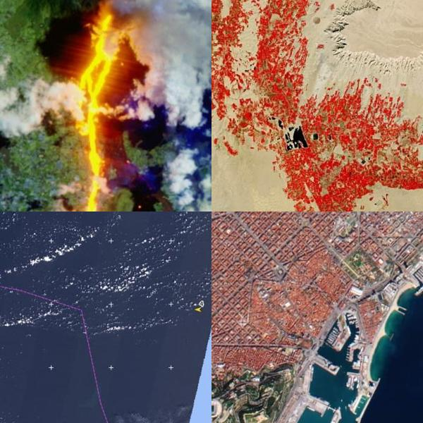
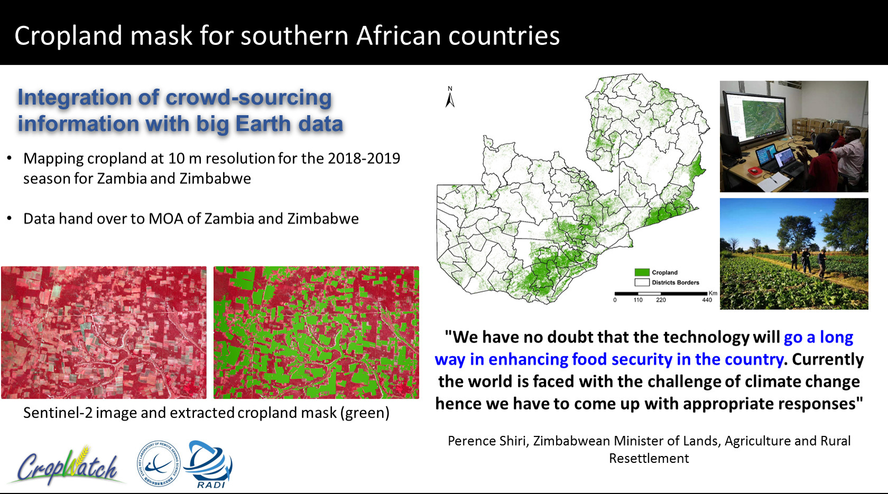
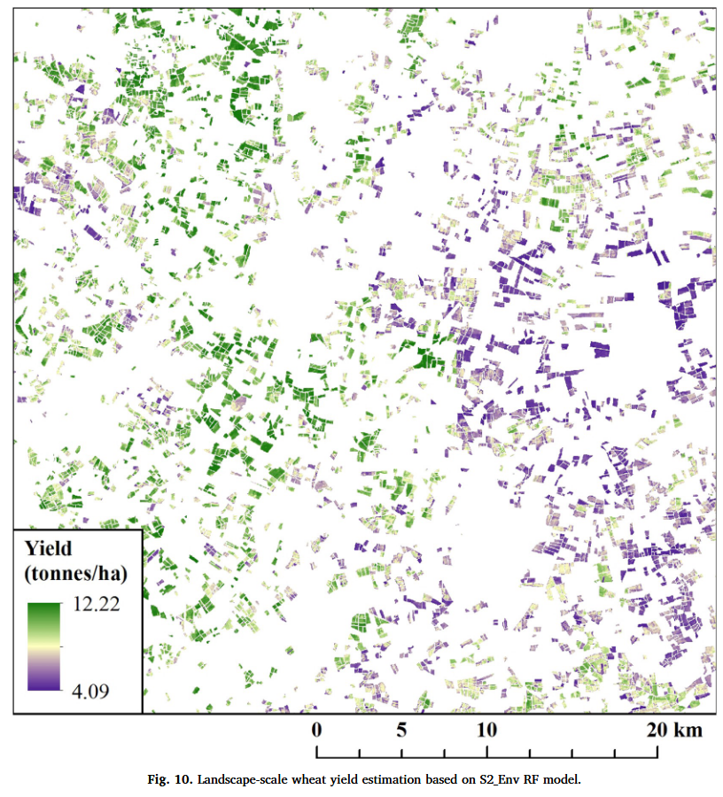

```{r setup, include=FALSE}
library(RefManageR)
library(knitcitations)
BibOptions(
  check.entries = FALSE,
  bib.style = "authoryear",
  cite.style = "authoryear",
  style = "markdown",
  hyperlink = TRUE,
  dashed = FALSE,
  no.print.fields = c("doi", "url", "urldate", "issn")
)
myBib <- ReadBib("ref.bib", check = FALSE)
```

class: inverse, center, middle

# Introduction


---

##  Introduction 

Sentinel-2 is a European mission that captures wide, high-resolution, multi-spectral images. It consists of two satellites, Sentinel-2A and Sentinel-2B, which share the same orbit and are spaced 180 degrees apart. 

### The 4 resolutions of the Sentinel-2:  


- **Spectral** = It has 13 spectral bands, from the Visible (VNIR) and Near Infra-Red (NIR) to the Short Wave Infra-Red (SWIR)

- **Spatial**= four bands at 10 m, six bands at 20 m, and three bands at 60 m spatial resolution

- **Temporal**=It gives a high revisit frequency of 5 days.

- **Radiometric** = MSI instrument is a 12-bit sensor with values between 0 and 4095 (4096 possibilities). The radiometric accuracy is less than 5% (goal 3%).  


**Sentinel-2 has high revisit frequency and high-resolution imagery, which can offer data with lots of details, so it should be addressed with more caution when referring to private issues. **

---

### Sentinel-2 Applications

It offers various services and applications, including land management, agriculture, forestry, disaster control, humanitarian relief operations, risk mapping, and security concerns.

.pull-left[
#### **The [main application](https://sentiwiki.copernicus.eu/web/s2-applications) include :**
1. Maritime Surveillance  
  
1. Emergency Management  

1. Land Monitoring  

1. Urbanism  

]

.pull-right[

```{r echo=FALSE, out.width='80%', fig.align='center'}

```
image credit:[Sentinel Online](https://sentinel.esa.int/web/sentinel/copernicus/sentinel-2)
]

---

#### **Band combinations commonly used in research ：**
- **True colour**: natural colours humans would naturally see

- **False Colour (urban)**: visualizing urbanized areas clearly plant

- **False colour**: It is most frequently used to assess plant density and health.

- **NDVI**: effective quantifying green vegetation index water

- **Moisture Index**: It is used to determine vegetation water content and monitor droughts.

- **SWIR**: measuring how much water is present in plants and soil

- **NDWI**: for water body mapping cloud

- **NDSI**: It is used to differentiate between cloud and snow cover Scene classification: Helping to distinguish between cloudy pixels, clear pixels and water pixels 


.footnote[[*] Now, there are a few band combinations to monitor changes in cities and, in the future, we can generate new indexes for city-specific materials. It’s Sentinel-2 suitable for application in urban environments?]

---
class: inverse, middle, center

# Application

---

### Sentinel-2’s Application in Agriculture
#### Organisations and projects

**GEOGLAM** is using agricultural Monitoring and Earth Observation（EO）to assess crop conditions on a country/global scale and to solve food security concerns.   

**Sen2Agri** as a part of the monitoring tools being used, is generated from Sentinel-2 and Landsat 8, which can reflect vegetation status indicators and plot cultivated crop type maps.

.pull-left[
#### **The [Project](https://sentiwiki.copernicus.eu/web/s2-applications) :**
A project named Cropland Mask for southern African countries makes high-resolution cropland masks by Sentinel-2 and improves field forecasting in support of food security status. It Contributes to the mechanisation of local agriculture.

]

.pull-right[

```{r echo=FALSE, out.width='100%', fig.align='center'}

```

image credit:[geoglam](https://earthobservations.org/geoglam.php)
]

---

### Sentinel-2’s Application in Agriculture
#### Academic research

In recent studies, Scholars have researched the use of Sentinel-2 for single-yield monitoring. `r Citet(myBib,"CROPYIELDESTIMATION")` explored the correlation between Sentinel-2 NDVI and spring barley yield data.  

`r Citet(myBib,"huntHighResolutionWheat2019")` explores the ability to map wheat fields with Sentinel-2. Random Forest Models created by Sentinel-2, combined with environment data (SWI) can provide accurate predictions. However, as the study area is England, the results may influenced by the cloud and will change hugely between different seasons.

```{r echo=FALSE, out.width='30%', fig.align='center'}

```
---

## Reflection

1. Sentinel-2 is a practical option for yield forecasting because it is free and has high resolution. Current research also proves the possibility of this.;

1. Yield forecasting of EO can collaborate with high-accuracy GPS technology, including combined harvesters and planters. It not only improves the modernisation of agriculture but also provides more details data for agriculture monitoring;

1. Different seasons can have various impacts on the accuracy of the results. So the monitoring methods need to be modified according to geographic location and seasons;

1. Vegetation indices(NDVI, VIs), although are well developed through much research. However, it does not perform well in crop yield forecasting. Maybe need to import new indexes and band combinations;

1. More research could be done on the application of the Sentinel-2 vegetation red edge bands for agricultural monitoring;


.footnote[[*] Satellite-specific applications for agricultural monitoring.]

---

## Reference

```{r references, results='asis', echo=FALSE}
PrintBibliography(myBib, start = 1, end = 2)
```